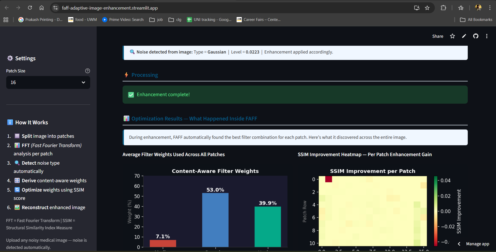
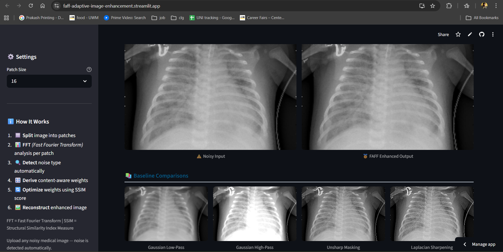
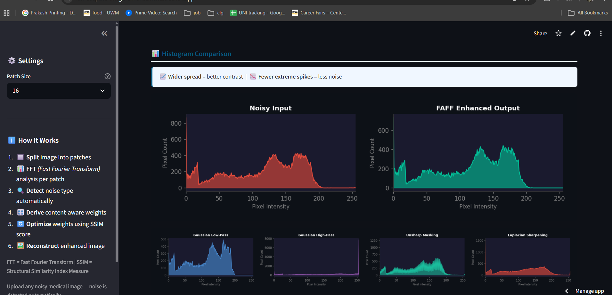

# FAFF — Adaptive Hybrid Enhancement for Medical Images

  Frequency-Aware Adaptive Filter Fusion with Iterative Quality Optimization  
  CS-712 Image Processing | University of Wisconsin-Milwaukee | Spring 2026  
  Author:   Ajay Aravind Prakash |   Professor:   Dr. Zeyun Yu

---

## ⚡ Quick Start

```bash
pip install -r requirements.txt
streamlit run app.py
```
Open   http://localhost:8501   in your browser.

---

## 🌐 Live Demo

  Try it online (no installation needed):  
https://faff-adaptive-image-enhancement.streamlit.app

---

## 📸 App Screenshots

>



---

## What Is This Project?

FAFF is a medical image enhancement system that automatically cleans up noisy X-rays, ultrasounds, and MRI scans. Unlike standard methods that apply one filter to the whole image, FAFF splits the image into small patches, analyzes each patch using FFT (Fast Fourier Transform), and automatically finds the best combination of filters for each region using SSIM (Structural Similarity Index Measure) as a quality score.

---

## Project Structure

```
medical_enhancement/
├── app.py                        ← Streamlit web application
├── src/
│   └── enhancer.py               ← Core FAFF algorithm
├── demo_noisy_xray.png           ← Demo image (place your X-ray here)
├── requirements.txt              ← Python dependencies
└── README.md                     ← This file
```

---

## How It Works (Simple)

```
Upload noisy medical image
        ↓
Auto-detect noise type and level
        ↓
Split image into 16x16 patches
        ↓
For each patch:
  1. Run 2D FFT → measure frequency content
  2. Derive smart starting weights
  3. Apply 3 filters: Median + Gaussian + Unsharp
  4. Optimize weights using SSIM score (up to 80 iterations)
  5. Keep best combination
        ↓
Stitch all patches back together
        ↓
Show: enhanced image + weight chart + SSIM heatmap + histogram
```

---

## Using the App

1. Upload any noisy medical image (X-ray, MRI, Ultrasound) — PNG, JPG, TIFF supported
2. Adjust   Patch Size   in sidebar if needed (16 recommended)
3. Click   Enhance   and wait for processing
4. View results:
   -   Optimization Results   — filter weights bar chart + SSIM improvement heatmap
   -   Image Comparison   — Noisy Input vs FAFF Enhanced side by side
   -   Baseline Comparisons   — 4 methods from course lectures
   -   Histogram Comparison   — pixel distribution before and after
5. Download the enhanced image

---

## Demo Image

Place your medical image as `demo_noisy_xray.png` in the project folder to use it with the demo button. Any real chest X-ray works well. Recommended sources:
- Kaggle: https://www.kaggle.com/datasets/paultimothymooney/chest-xray-pneumonia
- NIH Chest X-ray: https://nihcc.app.box.com/v/ChestXray-NIHCC

---

## Algorithm Parameters

| Parameter | Default | What It Does |
|-----------|---------|--------------|
| Patch Size | 16 | Size of image patches — 8 = more detail/slower, 32 = faster/less precise |
| Max optimizer iterations | 80 | How hard the optimizer works per patch |
| FFT high-freq threshold | 0.3/0.6 | Boundary between low/mixed/high frequency classification |

---

## Baseline Methods (All From Course Lectures)

| Method | Lecture | What It Does |
|--------|---------|--------------|
| Gaussian Low-Pass | Lecture 13 | Smoothing via low-pass frequency filtering |
| Gaussian High-Pass | Lecture 14 | Edge enhancement (H_HP = 1 - H_LP) |
| Unsharp Masking | Lecture 15 | Sharpening by boosting high-frequency residual |
| Laplacian Sharpening | Lecture 19 | Edge enhancement using second-order derivative |

---

## Key Acronyms

-   FAFF   = Frequency-Aware Adaptive Filter Fusion
-   FFT   = Fast Fourier Transform (Lecture 12)
-   SSIM   = Structural Similarity Index Measure
-   DFT   = Discrete Fourier Transform

---

## References

1. Gonzalez & Woods (2018). Digital Image Processing, 4th Ed. Pearson. [Course Textbook]
2. Wang et al. (2004). Image Quality Assessment: SSIM. IEEE Trans. Image Processing.
3. Nelder & Mead (1965). Simplex Method for Function Minimization. Computer Journal.
4. Virtanen et al. (2020). SciPy 1.0. Nature Methods.
5. Al-Dhabyani et al. (2020). BUSI Dataset. Data in Brief.
